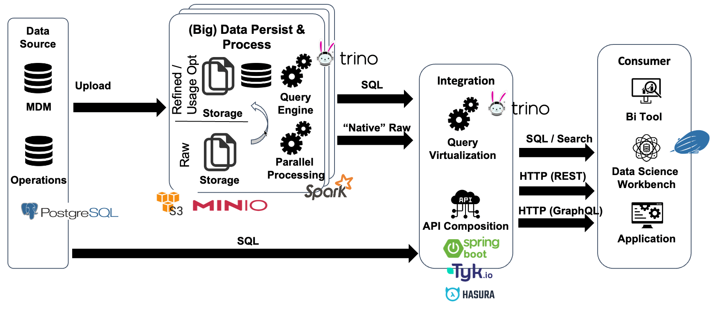
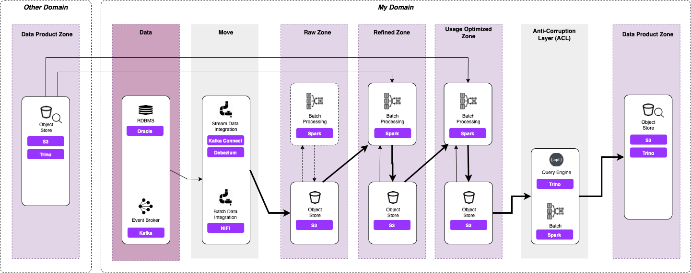
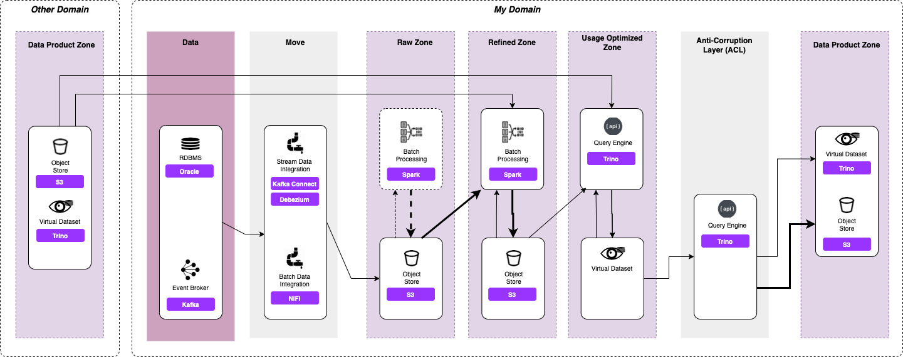
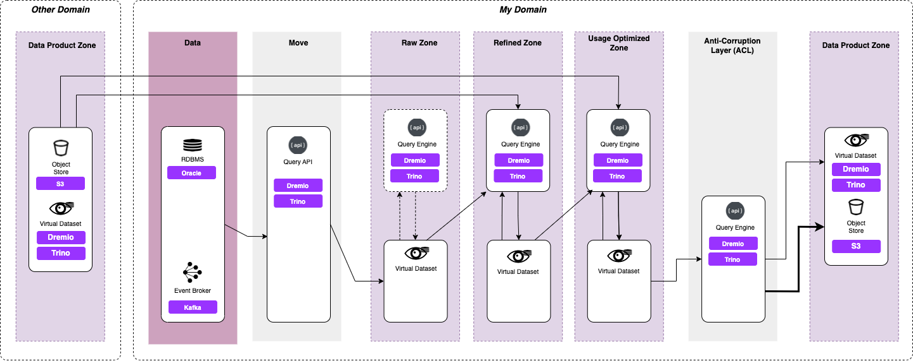
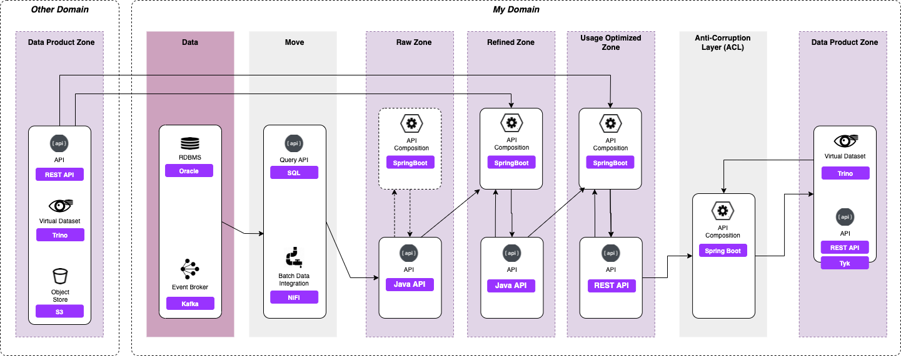

# Data Mesh PoC using adapted Data Lake Zone Model

This demo concentrates on showing the concept of providing Data Products of a Data Mesh using the adapted Data Lake Zone model. 




The following technologies will be shown as data products

* a database table or view
* raw unstructured files, e.g. videos, images, ...
* data stream of action events
* data stream of state change events
* [done] table format
* [done] REST API
* [done] GraphQL API 
* [done] Virtual Data Set
* Visualizations and dashboards

## Initialize Platform

```bash
git clone http://github.com/trivadispf/data-mesh-demo
cd data-mesh-demo/docker

docker-compose up -d
```

## Prepare Data

### Minio (S3)

A bucket named `flight-data` has been created while initializing the platform. No let's copy some data into this bucket.

```bash
docker exec -ti awscli s3cmd put /data-transfer/flight-data/airports.csv s3://flight-bucket/raw/airports/airports.csv

docker exec -ti awscli s3cmd put /data-transfer/flight-data/plane-data.csv s3://flight-bucket/raw/planes/plane-data.csv

docker exec -ti awscli s3cmd put /data-transfer/flight-data/carriers.json s3://flight-bucket/raw/carriers/carriers.json

docker exec -ti awscli s3cmd put /data-transfer/flight-data/flights-small/flights_2008_4_1.csv s3://flight-bucket/raw/flights/ &&
   docker exec -ti awscli s3cmd put /data-transfer/flight-data/flights-small/flights_2008_4_2.csv s3://flight-bucket/raw/flights/ &&
   docker exec -ti awscli s3cmd put /data-transfer/flight-data/flights-small/flights_2008_5_1.csv s3://flight-bucket/raw/flights/ &&
   docker exec -ti awscli s3cmd put /data-transfer/flight-data/flights-small/flights_2008_5_2.csv s3://flight-bucket/raw/flights/ &&
   docker exec -ti awscli s3cmd put /data-transfer/flight-data/flights-small/flights_2008_5_3.csv s3://flight-bucket/raw/flights/
```

<http://dataplatform:9000>

`V42FCGRVMK24JJ8DHUYG` and `bKhWxVF3kQoLY9kFmt91l+tDrEoZjqnWXzY9Eza`


## Building Materialized Data Product (Batch)

In this section we will demonstrate how to build a materialized data product using Spark and Minio (S3).



You can find the implementation in the Zeppelin notebook available in `zeppelin/data-mesh-zone-model.zpln`. Import it into Zeppelin available under <http://dataplatform:28080> (login as admin/changeme).

### Master Data Mgmt (MDM) Domain

#### Raw Zone

```sql
%sql
CREATE TABLE raw_airport_t
USING CSV
OPTIONS (sep=",", inferSchema="true", header="true")
LOCATION "s3a://flight-bucket/raw/airports
```

#### Refined Zone


```scala
val airportRefDf = spark.sql("""
	SELECT a.iata
	,      a.airport
	,      a.city
	,      a.state
	,      a.country
	,      a.lat         AS latitude
	,      a.long        AS longitude
	FROM raw_airport_t  a;
""")
```

```scala
airportRefDf.write.parquet("s3a://flight-bucket/refined/airports")

airportRefDf.createOrReplaceTempView("ref_airport_t")
```

#### Data Product Zone

```scala
val airportDpDf = spark.sql("""
    SELECT a.iata
    ,      a.airport
    ,      a.city
    ,      a.state
    ,      a.country
    ,      a.latitude
    ,      a.longitude
    FROM ref_airport_t  a;
""")
```

```scala
airportDpDf.write.parquet("s3a://flight-bucket/dp/v1/airports")

airportDpDf.createOrReplaceTempView("dp_airport_v1_t")
```

Let's register the data product as a Hive table (so it is available in Trino)

Connect to Hive-Metastore and create the `flight_db` database:

```
docker exec -ti hive-metastore hive

CREATE DATABASE mdm_db;
USE mdm_db;
```

and create the following table

```
CREATE EXTERNAL TABLE dp_airport_v1_t ( iata string
                             , airport string
                             , city string
                             , state string
                             , country string
                             , latitude double
                             , longitude double)
STORED AS parquet
LOCATION 's3a://flight-bucket/dp/v1/airports';
```

### Operations Domain

#### Raw Zone

```sql
CREATE TABLE raw_flight_t
USING CSV
OPTIONS (sep=",", inferSchema="true", header="false")
LOCATION "s3a://flight-bucket/raw/flights"
```

#### Refined Zone

```scala
val fligthRefDf = spark.sql("""
		SELECT INT (_c0)    AS year
		,   INT(_c1)        AS month
		,   INT(_c2)        AS day_of_month
		,   INT(_c3)        AS day_of_week
		,   INT(_c4)        AS departure_time
		,   INT(_c5)        AS scheduled_departure_time
		,   INT(_c6)        AS arrival_time
		,   INT(_c7)        AS scheduled_arrival_time
		,   STRING(_c8)     AS unique_carrier
		,   STRING(_c9)     AS flight_number
		,   STRING(_c10)    AS tail_number
		,   INT(_c11)       AS actual_elapsed_time
		,   INT(_c12)       AS estimated_elapsed_time
		,   INT(_c13)       AS airtime
		,   INT(_c14)       AS arrival_delay
		,   INT(_c15)       AS departure_delay
		,   STRING(_c16)    AS origin_airport_iata
		,   STRING(_c17)    AS destination_airport_iata
		,   INT(_c18)       AS distance
		,   INT(_c19)       AS taxi_in
		,   INT(_c20)       AS taxi_out
		,   INT(_c21)       AS cancelled
		,   STRING(_c22)    AS cancellation_code
		,   CASE 
		         WHEN _c22 = 'A' THEN 'carrier'
		         WHEN _c22 = 'B' THEN 'weather'
		         WHEN _c22 = 'C' THEN 'NAS'
		         WHEN _c22 = 'D' THEN 'security'
		    END             AS cancellation_reason
		,   STRING(_c23)    AS diverted
		,   INT(_c24)       AS carrier_delay
		,   INT(_c25)       AS weather_delay
		,   INT(_c26)       AS nas_delay
		,   INT(_c27)       AS security_delay
		,   INT(_c28)       AS late_aircraft_delay
		FROM raw_flight_t
""")
```

```scala
fligthRefDf.write.parquet("s3a://flight-bucket/refined/flights")

fligthRefDf.createOrReplaceTempView("ref_flight_t")
```

#### Usage Optimized Zone

##### Flight Enriched

```scala
val flightUsageOptDf = spark.sql("""
		SELECT f.*
		,      orig.airport          AS origin_airport
		,      orig.city             AS origin_city
		,      dest.airport          AS destination_airport
		,      dest.city             AS destination_city
		FROM ref_flight_t    f
		LEFT JOIN dp_airport_v1_t     orig
		    ON (f.origin_airport_iata = orig.iata)
		LEFT JOIN dp_airport_v1_t     dest
		    ON (f.destination_airport_iata = dest.iata)
""")
```

```scala
flightUsageOptDf.write.parquet("s3a://flight-bucket/usageopt/flights")

flightUsageOptDf.createOrReplaceTempView("usageopt_flight_t")
```

##### Flight Delays

```
val flightDelayUsageOptDf = spark.sql("""
		SELECT arrival_delay, origin_airport_iata, destination_airport_iata,
		    CASE
		         WHEN arrival_delay > 360 THEN 'Very Long Delays'
		         WHEN arrival_delay > 120 AND arrival_delay < 360 THEN 'Long Delays'
		         WHEN arrival_delay > 60 AND arrival_delay < 120 THEN 'Short Delays'
		         WHEN arrival_delay > 0 and arrival_delay < 60 THEN 'Tolerable Delays'
		         WHEN arrival_delay = 0 THEN 'No Delays'
		         ELSE 'Early'
		    END AS flight_delays
		         FROM ref_flight_t
		         ORDER BY arrival_delay DESC
""")
```

```scala
flightDelayUsageOptDf.write.parquet("s3a://flight-bucket/usageopt/flight_delays")

flightDelayUsageOptDf.createOrReplaceTempView("usageopt_flight_delay_t")
```

#### Data Product Zone

##### Flight Enriched

```scala
val flightDpDf = spark.sql("""
		SELECT f.year
		,   f.month
		,   f.day_of_month
		,   f.day_of_week
		,   f.departure_time
		,   f.scheduled_departure_time
		,   f.arrival_time
		,   f.scheduled_arrival_time
		,   f.unique_carrier
		,   f.flight_number
		,   f.tail_number
		,   f.actual_elapsed_time
		,   f.estimated_elapsed_time
		,   f.airtime
		,   f.arrival_delay
		,   f.departure_delay
		,   f.origin_airport_iata
		,   f.origin_airport
		,   f.origin_city
		,   f.destination_airport_iata
		,   f.destination_airport
		,   f.destination_city
		,   f.distance
		,   f.taxi_in
		,   f.taxi_out
		,   f.cancelled
		,   f.cancellation_code
		,   f.cancellation_reason
		,   f.diverted
		,   f.carrier_delay
		,   f.weather_delay
		,   f.nas_delay
		,   f.security_delay
		,   f.late_aircraft_delay
		FROM usageopt_flight_t    f
""")
```

```scala
flightDpDf.write.parquet("s3a://flight-bucket/dp/v1/flights")

flightDpDf.createOrReplaceTempView("dp_flight_v1_t")
```

##### Flight Delays

```scala
val flightDelayDpDf = spark.sql("""
		SELECT fd.arrival_delay
		,   fd.origin_airport_iata
		,   fd.destination_airport_iata
		,   fd.flight_delays
		FROM usageopt_flight_t    fd
""")
```

```scala
flightDelayDpDf.write.parquet("s3a://flight-bucket/dp/v1/flight_delays")

flightDelayDpDf.createOrReplaceTempView("dp_flight_delays_v1_t")
```

Let's register the data product as a Hive table (so it is available in Trino)

Connect to Hive-Metastore and create the `operations_db ` database:

```
docker exec -ti hive-metastore hive
CREATE DATABASE operations_db;
USE operations_db;
```

and create the following tables

```sql
CREATE EXTERNAL TABLE dp_flight_v1_t ( year integer
                            , month integer
                            , day_of_month integer
                            , day_of_week integer
                            , departure_time integer
                            , scheduled_departure_time integer
                            , arrival_time integer
                            , scheduled_arrival_time integer
                            , unique_carrier string
                            , flight_number string
                            , tail_number string
                            , actual_elapsed_time integer
                            , estimated_elapsed_time integer
                            , airtime integer
                            , arrival_delay integer
                            , departure_delay integer
                            , origin_airport_iata string
                            , origin_airport string
                            , origin_city string
                            , destination_airport_iata string
                            , destination_airport string
                            , destination_city string
                            , distance integer
                            , taxi_in integer
                            , taxi_out integer
                            , cancelled integer
                            , cancellation_code string
                            , cancellation_reason string
                            , diverted string
                            , carrier_delay integer
                            , weather_delay integer
                            , nas_delay integer
                            , security_delay integer
                            , late_aircraft_delay integer)
STORED AS parquet
LOCATION 's3a://flight-bucket/dp/v1/flights';

CREATE EXTERNAL TABLE dp_flight_delays_v1_t ( arrival_delay integer
                             , origin_airport_iata string
                             , destination_airport_iata string
                             , flight_delays string)
STORED AS parquet
LOCATION 's3a://flight-bucket/dp/v1/flight_delays';
```

#### Test usage of DP

From Trino, do a select

```bash
docker exec -it trino-cli trino --server trino-1:8080

use minio.operations_db;
```

```sql
SELECT * FROM dp_flight_v1_t;
```

## Virtualized (Partial) Data Product

In this section we will demonstrate how to build a parially virtualized data product using Trino on the data prepared in the previous section when materializing the data product. The idea here is to deliver the same data product but in virtualized manner (on-demand) instead of being materialized upfront. 



### Master Data Mgmt (MDM) Domain

For this example we are using the materialized data product which has been created and registered as a hive table above. 

### Operation Domain

#### Refined Zone

Create a Hive table on the `S3` objects in the Refined Zone Zone:

```sql
USE operations_db;

DROP TABLE IF EXISTS ref_flight_t;
CREATE EXTERNAL TABLE ref_flight_t ( year integer
											, month integer
											, day_of_month integer
											, day_of_week integer
											, departure_time integer
											, scheduled_departure_time integer
											, arrival_time integer
											, scheduled_arrival_time integer
											, unique_carrier string
											, flight_number string
											, tail_number string
											, actual_elapsed_time integer
											, estimated_elapsed_time integer
											, airtime integer
											, arrival_delay integer
											, departure_delay integer
											, origin_airport_iata string
											, destination_airport_iata string
											, distance integer
											, taxi_in integer
											, taxi_out integer
											, cancelled integer
											, cancellation_code string
											, cancellation_reason string
											, diverted string
											, carrier_delay integer
											, weather_delay integer
											, nas_delay integer
											, security_delay integer
											, late_aircraft_delay integer)
STORED AS parquet
LOCATION 's3a://flight-bucket/refined/flights';
```

#### Usage Optimized Zone

##### Flight Enriched

```bash
docker exec -it trino-cli trino --server trino-1:8080
```

```bash
use minio.operations_db;
```

```sql
CREATE VIEW usageopt_flight_v
AS 
SELECT f.*
,      orig.airport          AS origin_airport
,      orig.city             AS origin_city
,      dest.airport          AS destination_airport
,      dest.city             AS destination_city
FROM ref_flight_t    f
LEFT JOIN mdm_db.dp_airport_v1_t     orig
    ON (f.origin_airport_iata = orig.iata)
LEFT JOIN mdm_db.dp_airport_v1_t     dest
    ON (f.destination_airport_iata = dest.iata);
```

##### Flight Delays

```sql
CREATE VIEW usageopt_flight_delays_v
AS 
SELECT arrival_delay, origin_airport_iata, destination_airport_iata,
    CASE
         WHEN arrival_delay > 360 THEN 'Very Long Delays'
         WHEN arrival_delay > 120 AND arrival_delay < 360 THEN 'Long Delays'
         WHEN arrival_delay > 60 AND arrival_delay < 120 THEN 'Short Delays'
         WHEN arrival_delay > 0 and arrival_delay < 60 THEN 'Tolerable Delays'
         WHEN arrival_delay = 0 THEN 'No Delays'
         ELSE 'Early'
    END AS flight_delays
FROM ref_flight_t
ORDER BY arrival_delay DESC;
```

#### Data Product Zone

##### Flight Enriched

```sql
CREATE VIEW dp_flight_v1_v
AS
SELECT f.year
,   f.month
,   f.day_of_month
,   f.day_of_week
,   f.departure_time
,   f.scheduled_departure_time
,   f.arrival_time
,   f.scheduled_arrival_time
,   f.unique_carrier
,   f.flight_number
,   f.tail_number
,   f.actual_elapsed_time
,   f.estimated_elapsed_time
,   f.airtime
,   f.arrival_delay
,   f.departure_delay
,   f.origin_airport_iata
,   f.origin_airport
,   f.origin_city
,   f.destination_airport_iata
,   f.destination_airport
,   f.destination_city
,   f.distance
,   f.taxi_in
,   f.taxi_out
,   f.cancelled
,   f.cancellation_code
,   f.cancellation_reason
,   f.diverted
,   f.carrier_delay
,   f.weather_delay
,   f.nas_delay
,   f.security_delay
,   f.late_aircraft_delay
FROM usageopt_flight_v  f;
```

##### Flight Delays

```sql
CREATE OR REPLACE VIEW dp_flight_delays_v1
AS
SELECT fd.arrival_delay
,   fd.origin_airport_iata
,   fd.destination_airport_iata
,   fd.flight_delays
FROM usageopt_flight_delays_v fd;
```

## Virtualized (Full) Data Product

In this section we will demonstrate how to build a fully virtualized data product using Trino. 



```bash
docker exec -ti hive-metastore hive
CREATE DATABASE mdm_vdb;
CREATE DATABASE operations_vdb;
```

### Master Data Mgmt (MDM) Domain

```bash
docker exec -it trino-cli trino --server trino-1:8080
```

#### Refined Zone

```sql
use minio.mdm_vdb;

DROP VIEW IF EXISTS ref_airport_v;
CREATE VIEW ref_airport_v
AS
SELECT a.iata
,      a.airport
,      a.city
,      a.state
,      a.country
,      a.lat         AS latitude
,      a.long        AS longitude
FROM postgresql.mdm.airport_t  a;
```

#### Data Product Zone

```sql
DROP VIEW IF EXISTS dp_airport_v1_v;

CREATE VIEW dp_airport_v1_v
AS
SELECT a.iata
,      a.airport
,      a.city
,      a.state
,      a.country
,      a.latitude
,      a.longitude
FROM ref_airport_v  a;
```

### Operations Domain

```bash
docker exec -it trino-cli trino --server trino-1:8080
```

#### Refined Zone

```sql
use minio.operations_vdb;

CREATE VIEW ref_flight_v
AS
SELECT 
    year ,
    month ,
    day_of_month ,
    day_of_week ,
    dep_time  			AS departure_time,
    sched_dep_time 		AS scheduled_departure_time,
    arr_time 				AS arrival_time,
    sched_arr_time 		AS scheduled_arrival_time,
    unique_carrier,
    flight_number,
    tail_number,
    act_elapsed_time  	AS actual_elapsed_time,
    est_elapsed_time 	AS estimated_elapsed_time,
    airtime,
    arr_delay 			AS arrival_delay,
    dep_delay 			AS departure_delay,
    orig_airport 		AS origin_airport_iata,
    dest_airport 		AS destination_airport_iata,
    dist 					AS distance,
    taxi_in,
    taxi_out,
    cancelled,
    cancellation_cd 	AS cancellation_code,
	 CASE 
		         WHEN cancellation_cd = 'A' THEN 'carrier'
		         WHEN cancellation_cd = 'B' THEN 'weather'
		         WHEN cancellation_cd = 'C' THEN 'NAS'
		         WHEN cancellation_cd = 'D' THEN 'security'
    END             	AS cancellation_reason,    
    diverted,
    carrier_delay,
    weather_delay,
    nas_delay,
    security_delay,
    late_aircraft_delay  
FROM postgresql.operations.flight_t  f;
```

#### Usage Optimized Zone

##### Flight Enriched

```bash
docker exec -it trino-cli trino --server trino-1:8080
```

```bash
use minio.operations_vdb;
```

```sql
CREATE VIEW usageopt_flight_v
AS 
SELECT f.*
,      orig.airport          AS origin_airport
,      orig.city             AS origin_city
,      dest.airport          AS destination_airport
,      dest.city             AS destination_city
FROM ref_flight_v   f
LEFT JOIN mdm_vdb.dp_airport_v1_v     orig
    ON (f.origin_airport_iata = orig.iata)
LEFT JOIN mdm_vdb.dp_airport_v1_v     dest
    ON (f.destination_airport_iata = dest.iata);
```

##### Flight Delays

```sql
CREATE VIEW usageopt_flight_delays_v
AS 
SELECT arrival_delay, origin_airport_iata, destination_airport_iata,
    CASE
         WHEN arrival_delay > 360 THEN 'Very Long Delays'
         WHEN arrival_delay > 120 AND arrival_delay < 360 THEN 'Long Delays'
         WHEN arrival_delay > 60 AND arrival_delay < 120 THEN 'Short Delays'
         WHEN arrival_delay > 0 and arrival_delay < 60 THEN 'Tolerable Delays'
         WHEN arrival_delay = 0 THEN 'No Delays'
         ELSE 'Early'
    END AS flight_delays
         FROM ref_flight_v
         ORDER BY arrival_delay DESC;
```

#### Data Product Zone

##### Flight Enriched

```sql
CREATE OR REPLACE VIEW dp_flight_v1
AS
SELECT f.year
,   f.month
,   f.day_of_month
,   f.day_of_week
,   f.departure_time
,   f.scheduled_departure_time
,   f.arrival_time
,   f.scheduled_arrival_time
,   f.unique_carrier
,   f.flight_number
,   f.tail_number
,   f.actual_elapsed_time
,   f.estimated_elapsed_time
,   f.airtime
,   f.arrival_delay
,   f.departure_delay
,   f.origin_airport_iata
,   f.origin_airport
,   f.origin_city
,   f.destination_airport_iata
,   f.destination_airport
,   f.destination_city
,   f.distance
,   f.taxi_in
,   f.taxi_out
,   f.cancelled
,   f.cancellation_code
,   f.cancellation_reason
,   f.diverted
,   f.carrier_delay
,   f.weather_delay
,   f.nas_delay
,   f.security_delay
,   f.late_aircraft_delay
FROM usageopt_flight_v  f;
```

##### Flight Delays

```sql
CREATE OR REPLACE VIEW dp_flight_delays_v1
AS
SELECT fd.arrival_delay
,   fd.origin_airport_iata
,   fd.destination_airport_iata
,   fd.flight_delays
FROM usageopt_flight_delays_v fd;
```

## Rest API driven Data Product

In this section we will demonstrate how to build a REST API driven data product using Spring Boot and Tyk API Gateway. 



### Operations Domain

A REST API on top of Operations DP is available

```bash
curl http://dataplatform:48082/dp/flightDelays/LAX | jq
```

We are using Tyk (<https://tyk.io/>) here but Kong would be supported by Platys as well. 

<https://tyk.io/docs/tyk-gateway-api/api-definition-objects/>

Add an API without authorization (keyless) to TYK API Gateway

```bash
curl -v -H "x-tyk-authorization: abc123!" \
  -s \
  -H "Content-Type: application/json" \
  -X POST \
  -d '{
    "name": "Operations Data Product",
    "slug": "operations-dp",
    "api_id": "operations-dp",
    "org_id": "1",
    "use_keyless": true,
    "auth": {
      "auth_header_name": "Authorization"
    },
    "definition": {
      "location": "header",
      "key": "x-api-version"
    },
    "version_data": {
      "not_versioned": true,
      "versions": {
        "Default": {
          "name": "Default",
          "use_extended_paths": true
        }
      }
    },
    "proxy": {
      "listen_path": "/operations",
      "target_url": "http://data-mesh-poc-operations-db-api-1:8082/dp",
      "strip_listen_path": true
    },
    "active": true
}' http://dataplatform:28280/tyk/apis | jq
```

Reload Tyk API gateway

```bash
curl -H "x-tyk-authorization: abc123!" -s http://dataplatform:28280/tyk/reload/group | jq
```

```bash
curl http://dataplatform:28280/operations/flightDelays/LAX | jq

curl http://dataplatform:28280/operations/flights/LAX | jq
```

Add authorization (`keyless`: false)

```bash
curl -v -H "x-tyk-authorization: abc123!" \
  -s \
  -H "Content-Type: application/json" \
  -X POST \
  -d '{
    "name": "Operations Data Product",
    "slug": "operations-dp",
    "api_id": "operations-dp",
    "org_id": "1",
    "use_keyless": false,
    "auth": {
      "auth_header_name": "Authorization"
    },
    "definition": {
      "location": "header",
      "key": "x-api-version"
    },
    "version_data": {
      "not_versioned": true,
      "versions": {
        "Default": {
          "name": "Default",
          "use_extended_paths": true
        }
      }
    },
    "proxy": {
      "listen_path": "/operations",
      "target_url": "http://data-mesh-poc-operations-db-api-1:8082/dp",
      "strip_listen_path": true
    },
    "active": true
}' http://dataplatform:28280/tyk/apis | jq
```

Create an API Key

```
curl -X POST -H "x-tyk-authorization: abc123!" \
  -s \
  -H "Content-Type: application/json" \
  -X POST \
  -d '{
    "allowance": 1000,
    "rate": 1000,
    "per": 1,
    "expires": -1,
    "quota_max": -1,
    "org_id": "1",
    "quota_renews": 1449051461,
    "quota_remaining": -1,
    "quota_renewal_rate": 60,
    "access_rights": {
      "operations-dp": {
        "api_id": "operations-dp",
        "api_name": "Operations Data Product",
        "versions": ["Default"]
      }
    },
    "meta_data": {}
  }' http://dataplatform:28280/tyk/keys/create | jq
```

Reload Tyk API gateway

```bash
curl -H "x-tyk-authorization: abc123!" -s http://dataplatform:28280/tyk/reload/group | jq
```

Now the API will no longer work without using the `Authorization` header:

```bash
curl http://dataplatform:28280/operations/flights/LAX | jq
```

```bash
curl -H "Authorization: 1135d5a8518574998abf2357b4bcdca1b" http://dataplatform:28280/operations/flights/LAX | jq
```

Add throtling

```bash
curl -v -H "x-tyk-authorization: abc123!" \
  -s \
  -H "Content-Type: application/json" \
  -X POST \
  -d '{
    "name": "Operations Data Product",
    "slug": "operations-dp",
    "api_id": "operations-dp",
    "org_id": "1",
    "use_keyless": false,
    "auth": {
      "auth_header_name": "Authorization"
    },
    "definition": {
      "location": "header",
      "key": "x-api-version"
    },
    "version_data": {
      "not_versioned": true,
      "versions": {
        "Default": {
          "name": "Default",
          "use_extended_paths": true
        }
      }
    },
    "proxy": {
      "listen_path": "/operations",
      "target_url": "http://data-mesh-poc-operations-db-api-1:8082/dp",
      "strip_listen_path": true
    },
    "active": true,
    "global_rate_limit": {
       "rate": 5,
       "per": 60
    }
}' http://dataplatform:28280/tyk/apis | jq
```

Reload Tyk API gateway

```bash
curl -H "x-tyk-authorization: abc123!" -s http://dataplatform:28280/tyk/reload/group | jq
```

Execute the statement more than 5 times to show the throttling

```bash
curl -H "Authorization: 1135d5a8518574998abf2357b4bcdca1b" http://dataplatform:28280/operations/flightDelays/LAX | jq
```


## GraphQL Data Product

<dataplatform:28177>

